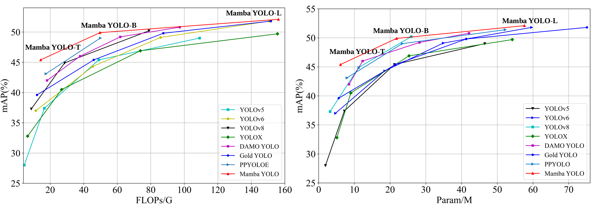

# Mamba-YOLO
Official pytorch implementation of “Mamba-YOLO：SSMs-based for Object Detection”


[](README.md)



## Installation
``` shell
# pip install required packages

pip install seaborn thop timm einops
cd selective_scan && pip install . && cd ..
pip install -v -e .
```

## Training

```shell
python3 mbyolo_train.py --task train --data ultralytics/cfg/datasets/coco.yaml \
 --config ultralytics/cfg/models/mamba-yolo/Mamba-YOLO-T.yaml \
--amp  --project ./output_dir/mscoco --name mambayolo_n
```

## Acknowledgement

This repo is modified from open source real-time object detection codebase [Ultralytics](https://github.com/ultralytics/ultralytics). The selective-scan from [VMamba](https://github.com/MzeroMiko/VMamba).
